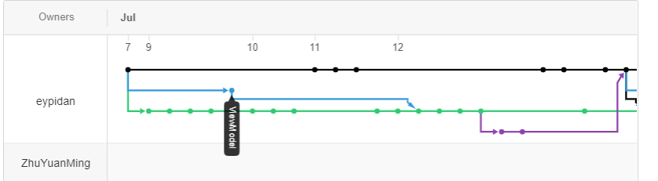
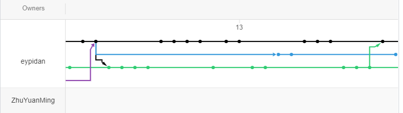
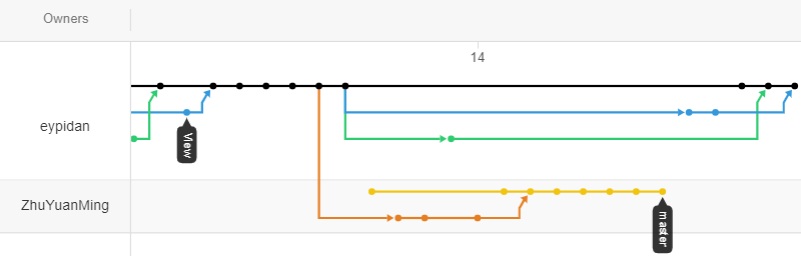
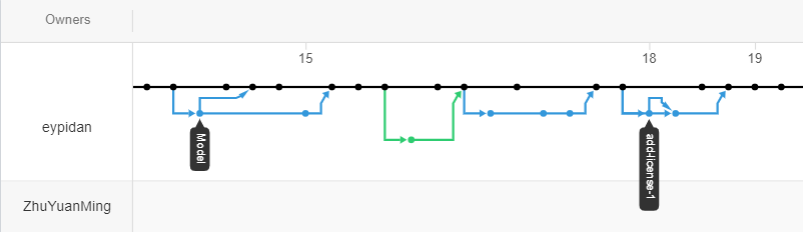
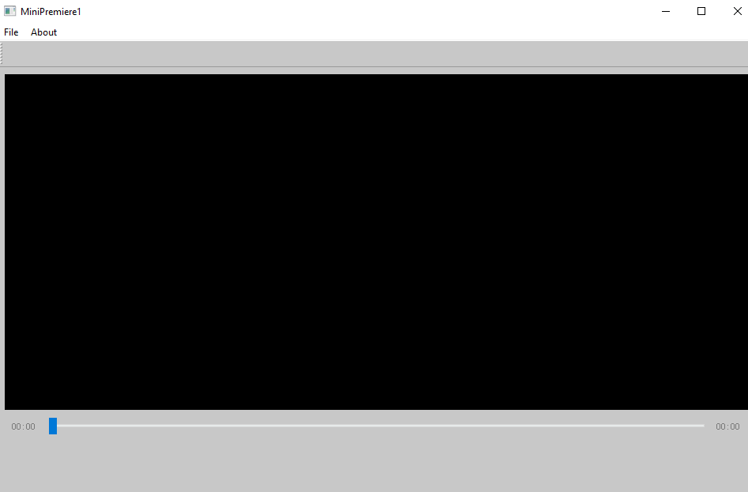
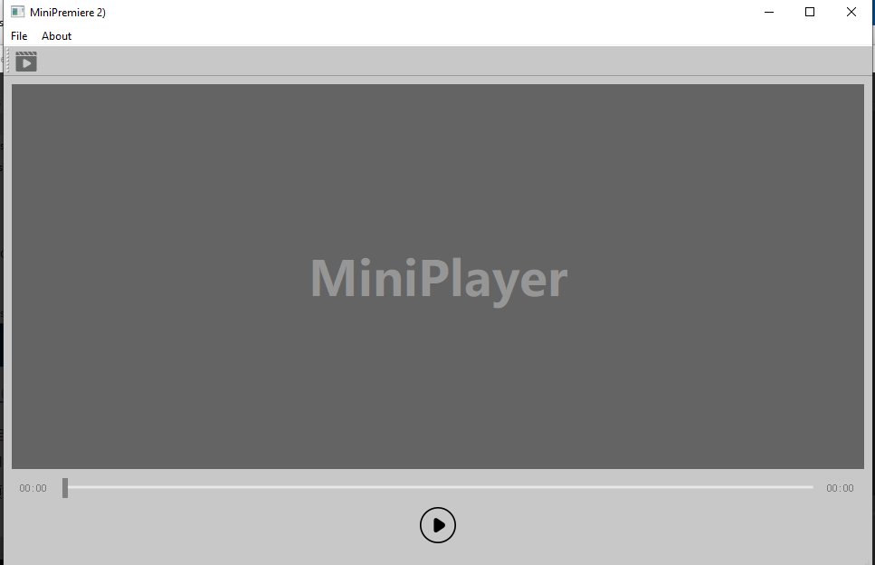
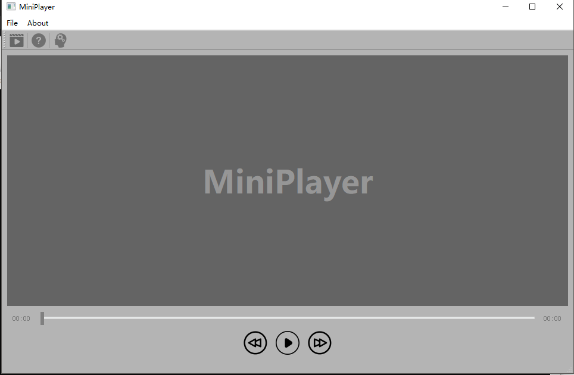
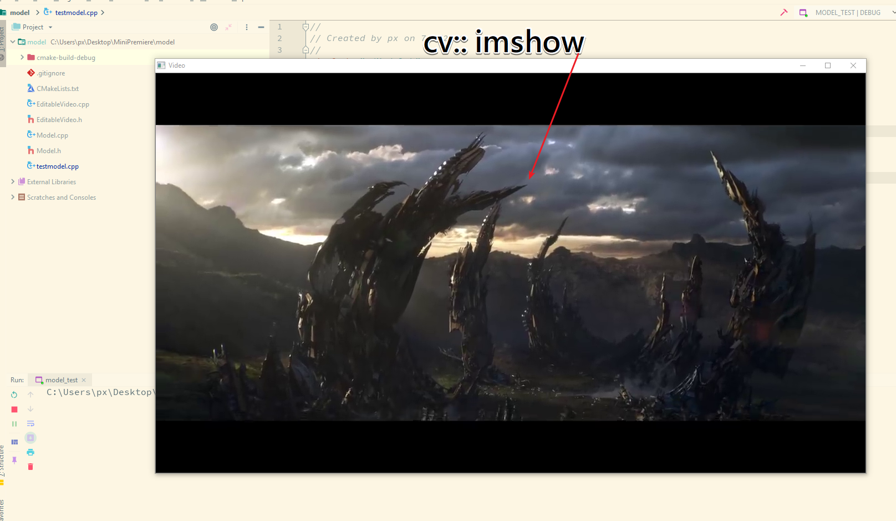
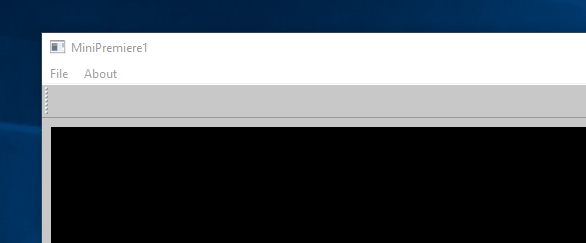

# MiniPlayer 总体报告

###  问题与背景

- 需要采用MVVM框架设计开发一款C++软件，并在这个过程中熟悉目前先进的开发流程

- 我们小组对于目前的视频播放的实现方式非常感兴趣，决定实现一款简易的视频播放软件，支持对视频文件的播放和跳转功能。

  

###  开发计划和分工
#### 开发计划

- 首先根据需求分析设计初步的UI，以快速实现第一轮迭代为目标，确定common层
- 实现travis ci持续集成环境的搭建，使服务器端能自动安装Qt、openCV、ffmpeg，并使用cmake来编译我们的代码，编译后使用ctest进行单元测试，并在每次master分支发生改变时自动触发travis ci的集成功能
- 深入了解MVVM框架，并根据MVVM框架以及需求分析初步实现MVVM框架的搭建
- 进一步与ViewModel中第一轮
- 实现Model层中对视频文件的解码功能，提供可以返回一张Qimage图片的接口（第二轮迭代）
- 实现View层中函数图像放大缩小等基本交互功能。
- 

#### 小组分工

- 组长
	- [庞思源](https://github.com/eypidan/)
		- 与雷骁同学一起进行分工协调，MVVM框架的搭建
		- 负责ViewModel层对Command、model层的组合
		- 负责Model层，在model层使用ffmpeg和opencv来解析视频文件，提供获得帧、时长等数据的接口给ViewModel层
		- 完成总体报告
- 组员
	- [雷骁](https://github.com/Wooooooooooooow/)（github用了两个账号，commit记录中的Wooooooooooooow，Xiao Lei 是同一人）
		- 共同搭建MVVM开发框架
		- 负责View层部分,提供ui界面设计以及视频播放效果
		- 负责app层的整合部分,使程序正确运行
		- 项目的需求报告部分
	- [朱缘明](https://github.com/ZhuYuanMing)
		
		- 实现了Qt、opencv、ffmpeg的ubuntu环境配置和整体项目的自动部署
		
		  
### 每轮迭代效果说明

#### 开发结构流程图
View分支和model分支分开开发，model分支包含了Model层和VideModel层两部分，向master分支合并即为一次集成。









#### 第一轮迭代（[ v1.0](https://github.com/eypidan/MiniPremiere/tree/v1.0)）

- 完成初步UI设计
- 通过OpenFileCommand第一次通过app层将View、ViewModel、Model层整合起来
- 


#### 第二轮迭代（[ v1.0.1](https://github.com/eypidan/MiniPremiere/tree/v1.0.1)）

- 增加FetchQimageCommand，使得View层可以通过ViewModel得到model处理好的Qimage

- 由于使用了MVVM框架，本次迭代速度很快，前后端在确定Command之后分离开发再合并

- 本次迭代增加视频播放功能，并可以暂停

- 

  
  


#### 第三轮迭代（[1.0.18](https://github.com/eypidan/MiniPremiere/tree/1.0.18)）
- 增加RefreshTimeStampCommand，使得View层可以通过传入时间来进行跳转

- 通过此command，我们增加了快进和快退功能

  


### 持续集成

我们本次使用了travis ci来进行持续集成与自动化部署到github release。在yml中，由于本次项目目标实现跨平台，所以编程环境要求适用Qt、Opencv和ffmpeg, 本次项目我们主要实现了opencv、ffmpeg的ubuntu环境配置和整体项目的自动部署。

#### 环境配置

1. opencv

   ```sh
     - sudo apt-get install -y build-essential
     - sudo apt-get install -y cmake git libgtk2.0-dev pkg-config libavcodec-dev libavformat-dev libswscale-dev libqt5gui5 libqt5gui5 qt5-default qttools5-dev-tools libqt5concurrent5 libqt5widgets5
     - sudo apt-get install -y python-dev python-numpy libtbb2 libtbb-dev libjpeg-dev libpng-dev libtiff-dev libjasper-dev libdc1394-22-dev
     - sudo apt-get install libpostproc-dev libavfilter-dev libavdevice-dev
   
       - git clone https://github.com/opencv/opencv.git
     - cd opencv
     - mkdir -p build
     - cd build
     - cmake -DCMAKE_INSTALL_PREFIX=/usr/local -DCMAKE_BUILD_TYPE=RELEASE -DBUILD_EXAMPLES=off -DBUILD_DOCS=off -DBUILD_SHARED_LIBS=off  -DBUILD_FAT_JAVA_LIB=off -DBUILD_TESTS=off -DBUILD_TIFF=on -DBUILD_JASPER=on -DBUILD_JPEG=on  -DBUILD_OPENEXR=on -DBUILD_PNG=on -DBUILD_TIFF=on -DBUILD_ZLIB=on -DBUILD_opencv_apps=off -DBUILD_opencv_calib3d=off -DBUILD_opencv_contrib=off -DBUILD_opencv_features2d=off -DBUILD_opencv_flann=off -DBUILD_opencv_gpu=off -DBUILD_opencv_java=off -DBUILD_opencv_legacy=off -DBUILD_opencv_ml=off -DBUILD_opencv_nonfree=off -DBUILD_opencv_objdetect=off -DBUILD_opencv_ocl=off -DBUILD_opencv_photo=off -DBUILD_opencv_python=off -DBUILD_opencv_stitching=off -DBUILD_opencv_superres=off -DBUILD_opencv_ts=off -DBUILD_opencv_video=off -DBUILD_opencv_videostab=off -DBUILD_opencv_world=off -DBUILD_opencv_lengcy=off -DBUILD_opencv_lengcy=off -DWITH_1394=off -DWITH_EIGEN=off -DWITH_FFMPEG=off -DWITH_GIGEAPI=off -DWITH_GSTREAMER=off -DWITH_GTK=on -DWITH_PVAPI=off -DWITH_V4L=off -DWITH_LIBV4L=off -DWITH_CUDA=off -DWITH_CUFFT=off -DWITH_OPENCL=off -DWITH_OPENCLAMDBLAS=off -DWITH_OPENCLAMDFFT=off ..
     - sudo make -j4 install
     - sudo sh -c 'echo "/usr/local/lib" > /etc/ld.so.conf.d/opencv.conf'
     - sudo ldconfig
     - cd ..
     - cd ..
   ```

   

2. Qt

- 关于Qt我们这里使用了脚本来安装最新的5.13.0版本，安装bash脚本在[extract-qt-installer](../extract-qt-installer),  [install-qt](../install-qt)

- 在.travis.yml中做如下执行即可

   ```sh
     - wget -c http://download.qt.io/official_releases/qt/5.13/5.13.0/qt-opensource-linux-x64-5.13.0.run
     - sudo chmod +x qt-opensource-linux-x64-5.13.0.run
     - sudo chmod +x ./extract-qt-installer ./install-qt
     - sudo ./install-qt
   ```

   

3. ffmpeg
  本项目采用ffmpeg-4.1.3版本。

  &emsp;
  关于ffmpeg环境的配置

  ```shell
    - sudo add-apt-repository -y ppa:jonathonf/ffmpeg-4
    - sudo apt-get update  
    - sudo apt-get install ffmpeg
  ```


#### 自动部署

&emsp;
由于yml文件不仅仅可以实现文件的检错，也可以适用于github的release版本的发行。本次项目决定实现每次本地从master分支push文件都自动检错并发行代码和可执行文件的自动部署功能。

```shell
before_deploy:
  - export TRAVIS_TAG="1.0.$TRAVIS_BUILD_NUMBER"
  - git config --global user.name "$USER_NAME"
  - git config --global user.email "$USER_EMAIL" 
  - git tag "$TRAVIS_TAG" "$TRAVIS_COMMIT"

deploy:
  provider: releases
  tag_name: $TRAVIS_TAG
  target_commitish: $TRAVIS_COMMIT
  overwirte: true
  api_key: $GIT_TOKEN 
  file_glob: true
  file:
    - MiniPreimere 
  name: MiniPlayer-$TRAVIS_TAG
  skip-cleanup: true
  on:
      branch: master
      repo: eypidan/MiniPremiere

```

#### 效果展示

- yml的通过


- yml文件的环境编译


- yml文件的自动部署


- github的release效果图


### 单元测试

#### 测试原理(model 部分)

- 创建一个Model实例testModel，通过调用Model的`openfile()`方法，绑定我们需要处理的视频文件。（测试`openfile()`）
- 通过调用`seekImage()`方法，跳回视频开始。（测试`seekImage()`）
- 在循环函数内部调用`getNextImage()`，连续获得一帧帧的`cv::Mat`图像。(测试`getNextImage()`)

```C++
#include "./Model.h"

int main(){

    Model testModel;
    std::shared_ptr<EditableVideo> testVideo;
    testVideo = testModel.openFile("C:\\Users\\px\\Downloads\\erer.mp4");
    std::shared_ptr<cv::Mat> testMat;
    testVideo->seekImage(0);
    for(int i=0;i<20;i++){
        testMat = testVideo->getNextImage();
        cv::namedWindow("Video", CV_WINDOW_AUTOSIZE);
        cv::imshow("Video", *testMat);
        cv::waitKey(4);
    }
    testVideo = testModel.openFile("C:\\Users\\px\\Downloads\\lala.mp4");
    testVideo->seekImage(15);
    for(int i=0;i<300;i++){
        testMat = testVideo->getNextImage();
        cv::namedWindow("Video", CV_WINDOW_AUTOSIZE);
        cv::imshow("Video", *testMat);
        cv::waitKey(4);
    }
}
```


#### 测试结果




### 最终运行效果图

#### 软件界面


#### 打开文件功能

#### 播放功能

#### 跳转功能


### 项目目录

```
.
├── App
│   ├── app.cpp
│   ├── app.h
│   └── main.cpp
├── CMakeLists.txt
├── common
│   ├── command.h
│   └── notification.h
├── extract-qt-installer
├── install-qt
├── LICENSE
├── model
│   ├── CMakeLists.txt
│   ├── EditableVideo.cpp
│   ├── EditableVideo.h
│   ├── Model.cpp
│   ├── Model.h
│   └── testmodel.cpp
├── readme.md
├── test.txt
├── View
│   ├── CMakeLists.txt
│   ├── image
│   │   ├── back.png
│   │   ├── developer.png
│   │   ├── forward.png
│   │   ├── help.png
│   │   ├── open.png
│   │   ├── pause.png
│   │   ├── play.png
│   │   └── zju.png
│   ├── MainWindow.cpp
│   ├── MainWindow.h
│   ├── MySlider.cpp
│   ├── MySlider.h
│   ├── Notification
│   │   ├── UpdateTimeStampNotification.cpp
│   │   ├── UpdateTimeStampNotification.h
│   │   ├── UpdateViewNotification.cpp
│   │   └── UpdateViewNotification.h
│   └── View.cpp
└── ViewModel
    ├── CMakeLists.txt
    ├── commands
    │   ├── FetchQimageCommand.cpp
    │   ├── FetchQimageCommand.h
    │   ├── OpenFileCommand.cpp
    │   ├── OpenFileCommand.h
    │   ├── RefreshTimeStamp.cpp
    │   └── RefreshTimeStamp.h
    ├── testViewModel.cpp
    ├── ViewModel.cpp
    └── ViewModel.h

9 directories, 46 files
```

