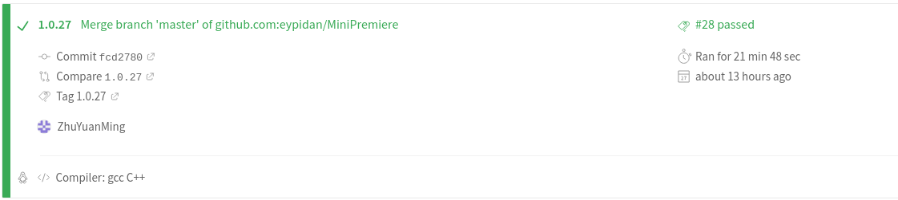
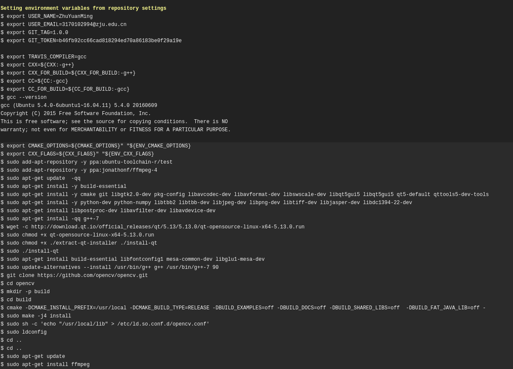
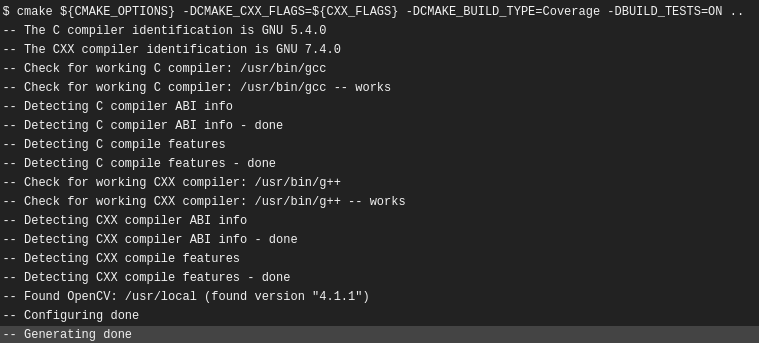
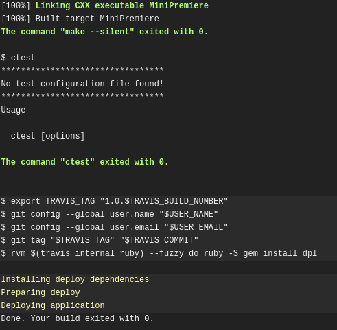
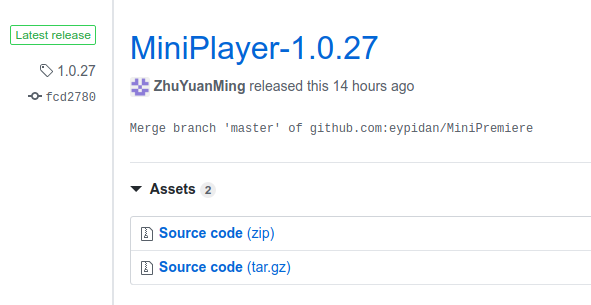

# 朱缘明个人报告

> **Author: 朱缘明**
> 
>**Student ID: 3170102994**
>
>**Date: 2019-6-26**

## 分工任务及解决方案
&emsp;
本次项目分为三轮迭代，三轮迭代中我完成的工作主要是了解关于当前项目环境的配置以及yml文件的持续集成和自动部署
由于本次项目目标实现跨平台，所以编程环境要求适用Qt、Opencv和ffmpeg。
&emsp;
在yml中，本次项目我主要实现了opencv、ffmpeg的ubuntu环境配置和整体项目的自动部署。

## 环境配置
### opencv
&emsp;
本项目采用opencv-3.4.6版本。

&emsp;
关于opencv环境的配置
```sh
  - sudo apt-get install -y build-essential
  - sudo apt-get install -y cmake git libgtk2.0-dev pkg-config libavcodec-dev libavformat-dev libswscale-dev libqt5gui5 libqt5gui5 qt5-default qttools5-dev-tools libqt5concurrent5 libqt5widgets5
  - sudo apt-get install -y python-dev python-numpy libtbb2 libtbb-dev libjpeg-dev libpng-dev libtiff-dev libjasper-dev libdc1394-22-dev
  - sudo apt-get install libpostproc-dev libavfilter-dev libavdevice-dev

    - git clone https://github.com/opencv/opencv.git
  - cd opencv
  - mkdir -p build
  - cd build
  - cmake -DCMAKE_INSTALL_PREFIX=/usr/local -DCMAKE_BUILD_TYPE=RELEASE -DBUILD_EXAMPLES=off -DBUILD_DOCS=off -DBUILD_SHARED_LIBS=off  -DBUILD_FAT_JAVA_LIB=off -DBUILD_TESTS=off -DBUILD_TIFF=on -DBUILD_JASPER=on -DBUILD_JPEG=on  -DBUILD_OPENEXR=on -DBUILD_PNG=on -DBUILD_TIFF=on -DBUILD_ZLIB=on -DBUILD_opencv_apps=off -DBUILD_opencv_calib3d=off -DBUILD_opencv_contrib=off -DBUILD_opencv_features2d=off -DBUILD_opencv_flann=off -DBUILD_opencv_gpu=off -DBUILD_opencv_java=off -DBUILD_opencv_legacy=off -DBUILD_opencv_ml=off -DBUILD_opencv_nonfree=off -DBUILD_opencv_objdetect=off -DBUILD_opencv_ocl=off -DBUILD_opencv_photo=off -DBUILD_opencv_python=off -DBUILD_opencv_stitching=off -DBUILD_opencv_superres=off -DBUILD_opencv_ts=off -DBUILD_opencv_video=off -DBUILD_opencv_videostab=off -DBUILD_opencv_world=off -DBUILD_opencv_lengcy=off -DBUILD_opencv_lengcy=off -DWITH_1394=off -DWITH_EIGEN=off -DWITH_FFMPEG=off -DWITH_GIGEAPI=off -DWITH_GSTREAMER=off -DWITH_GTK=on -DWITH_PVAPI=off -DWITH_V4L=off -DWITH_LIBV4L=off -DWITH_CUDA=off -DWITH_CUFFT=off -DWITH_OPENCL=off -DWITH_OPENCLAMDBLAS=off -DWITH_OPENCLAMDFFT=off ..
  - sudo make -j4 install
  - sudo sh -c 'echo "/usr/local/lib" > /etc/ld.so.conf.d/opencv.conf'
  - sudo ldconfig
  - cd ..
  - cd ..
```

&emsp;
由于本次项目只需要使用opencv core和opencv highgui包所以在编译选项中只选择这两项为on，同时为了流畅播放视频可以选择安装gtk2，同时将opencv的编译环境WITH_GTK设置为ON。
最终将opencv编译入gcc的库里，也即 usr/local/ 目录下。

### ffmpeg

&emsp;
本项目采用ffmpeg-4.1.3版本。

&emsp;
关于ffmpeg环境的配置

```shell
  - sudo add-apt-repository -y ppa:jonathonf/ffmpeg-4
  - sudo apt-get update  
  - sudo apt-get install ffmpeg
```
&emsp;
由于ffmpeg手动编译繁琐，同时依赖关系造成的编译问题比opencv更复杂，所以此处选择直接安装编译。


## 自动部署

&emsp;
由于yml文件不仅仅可以实现文件的检错，也可以适用于github的release版本的发行。本次项目决定实现每次本地从master分支push文件都自动检错并发行代码和可执行文件的自动部署功能。

```shell
before_deploy:
  - export TRAVIS_TAG="1.0.$TRAVIS_BUILD_NUMBER"
  - git config --global user.name "$USER_NAME"
  - git config --global user.email "$USER_EMAIL" 
  - git tag "$TRAVIS_TAG" "$TRAVIS_COMMIT"

deploy:
  provider: releases
  tag_name: $TRAVIS_TAG
  target_commitish: $TRAVIS_COMMIT
  overwirte: true
  api_key: $GIT_TOKEN 
  file_glob: true
  file:
    - MiniPreimere 
  name: MiniPlayer-$TRAVIS_TAG
  skip-cleanup: true
  on:
      branch: master
      repo: eypidan/MiniPremiere

```

&emsp;
关于自动部署所需要跨平台的makefile文件内容如下：

```shell
cmake_minimum_required(VERSION 3.12)
project(MiniPreimere)

set(CMAKE_CXX_STANDARD 17)
set(CMAKE_AUTOMOC ON)
set(CMAKE_AUTOUIC ON)
SET(CMAKE_AUTOrCC ON)
set(CMAKE_INCLUDE_CURRENT_DIR ON)


if(WIN32)
    include_directories(C:/CodeLibrary/opencv-3.4.6/build/install/include)
    include_directories(C:/CodeLibrary/ffmpeg-4.1.3-win64-dev/include)
    link_directories(C:/CodeLibrary/ffmpeg-4.1.3-win64-dev/lib)
    set(CMAKE_PREFIX_PATH C:/Qt/5.13.0/mingw73_64/lib/cmake  C:/CodeLibrary/opencv-3.4.6/build/install)
endif(WIN32)

if(UNIX)
    set(CMAKE_PREFIX_PATH /home/zhuyuanming/Qt5.13.0/5.13.0/gcc_64/lib/cmake)
endif(UNIX)

# find and set Qt
find_package(Qt5Gui REQUIRED)
find_package(Qt5Multimedia REQUIRED)
find_package(Qt5Core REQUIRED)
find_package(Qt5Widgets REQUIRED)

# find and set openCV
find_package(OpenCV)
set(OpenCV_LIBS opencv_core  opencv_highgui opencv_imgproc)
# set ffmpeg

set(ffmpeg_LIBS avcodec avformat avutil avdevice swscale)


set(SOURCE_FILES ./App/app.cpp ./App/main.cpp ./View/MainWindow.cpp ./View/Notification/UpdateViewNotification.cpp  ./View/Notification/UpdateTimeStampNotification.cpp ./View/MySlider.cpp ./ViewModel/commands/FetchQimageCommand.cpp ./ViewModel/commands/OpenFileCommand.cpp ./ViewModel/commands/RefreshTimeStamp.cpp ./ViewModel/ViewModel.cpp  ./model/Model.cpp  ./model/EditableVideo.cpp)
#link

add_executable(MiniPremiere ${SOURCE_FILES})
target_link_libraries(MiniPremiere ${OpenCV_LIBS} avcodec avdevice avfilter avformat swresample avutil postproc swresample swscale Qt5::Widgets Qt5::Core Qt5::Gui Qt5::Multimedia)


```

&emsp;
如上所示，所发行的版本标签号由当前的travis-ci的测试号代替，可以实现本身tag的自动增长，避免每次手动输入参数。

## 效果展示

### yml的通过



### yml文件的环境编译




### yml文件的自动部署






### github的release效果图



## 心得体会
&emsp;
本次项目要求多人协作又采用mvvm模式使三人工作可以分别独立进行，使人收益匪浅。在本次项目中，我的工作主要是实现本项目的yml编写，由于travis-ci的运行时间不能超过1h，直接编译大型库直接超时，所以本次项目主要的收获是，了解了opencv为代表的一系列大型第三方库的编译过程与编译指令，同时对手动添加动态链接库有了一定的经验。

## 建议
&emsp;
建议老师在讲述mvvm模式的时候，可以夹杂几个往年项目的例子简单介绍一下，加快加深新生对mvvm、mvc模式的理解。
