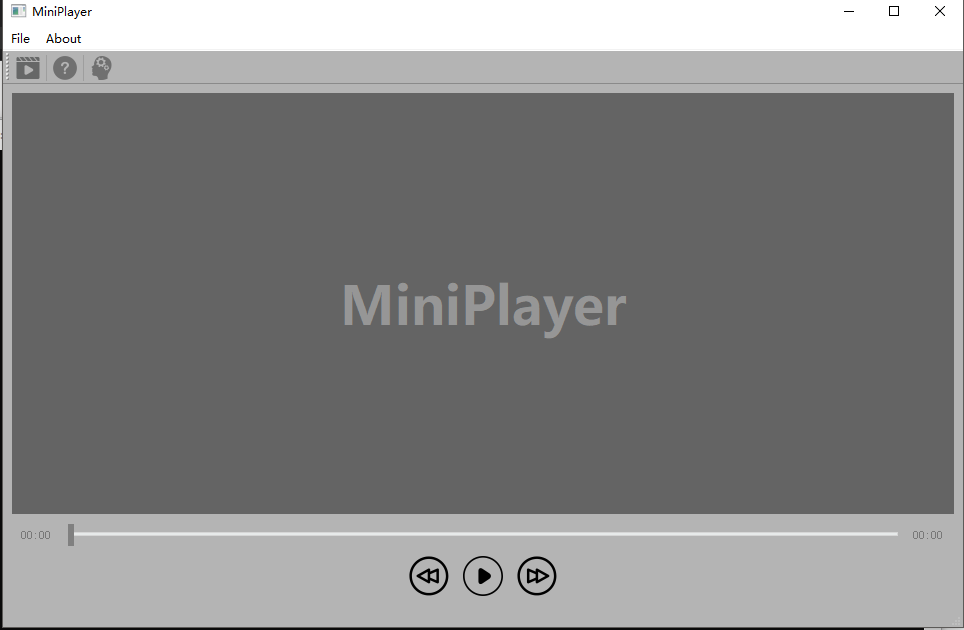

# 个人报告-雷骁
### 个人分工
我个人完成的部分如下:
- 共同搭建MVVM开发框架
- 负责View层部分,提供ui界面设计以及视频播放效果
- 负责app层的整合部分,使程序正确运行
- 项目的需求报告部分

#### MVVM框架搭建
这部分见组长(庞思源)的报告

#### View层ui设计
- 使用的是Qt纯代码方式进行开发设计,界面由一个主要窗口和一些消息窗口组成,同时附带一些工具栏(Open File, Exit, About, Help), 以及一个状态栏(实现鼠标悬浮于工具栏之上显示提示信息),和一个时间进度条,以及三个按钮(快退5s,播放/暂停,快进5s)
- 视频播放原理是从与ViewModel层进行直接交互,得到处理好的各种信息(时长,帧率,每帧图片)
- 然后根据这些信息在View层不断刷新QImage对象(即每帧图片),达到播放效果
##### 最终效果

#### App层的整合组装
- 实现View层和ViewModel层之间的Data绑定
- 将ViewModel层的Command提供给View进行绑定,实现View层对Command的调用
- 在View层提供Notification给ViewModel层,实现命令结束后对View层的及时更新

### 本课程心得体会
- 学会了MVVM开发框架的搭建,体会到该框架的先进性,使得团队之间的开发合作变得独立简单
- 初步掌握了Qt的一些开发方式,会进行一些基本的界面设计

### 对课程的建议
- 课程时间对于大作业的完成来说还是比较友好的,提供了足够多的时间进行设计实现
- 但是在理论课的授课方面,就我们小组而言,在MVVM框架搭建方面遇到了不小的困难,而实际上大作业的难点很大一部分来自于这个框架的理解和搭建,所以希望老师在后续的授课中在对MVVM开发框架的介绍和了解方面能够在提供理论讲解的同时,辅以对实际开发的分析解释(虽然也课程中提供了demo会有一定的帮助,但是我感觉讲解一下会更加清晰)